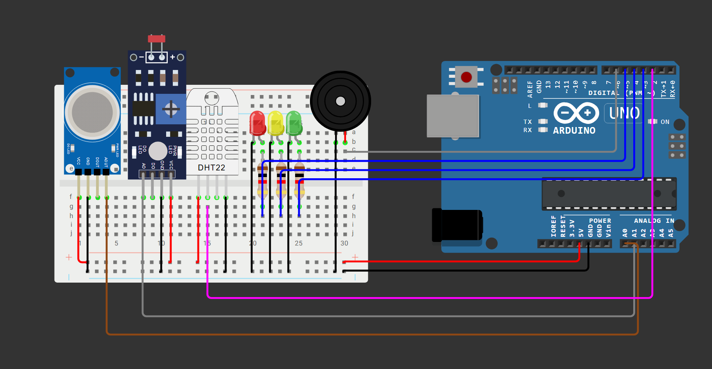

# ☀️ SOLARIA

## 📖 Descrição do Projeto

O SOLARIA é um sistema embarcado desenvolvido com Arduino Uno que simula o monitoramento de tempestades solares. Utilizando sensores de luminosidade, gás, temperatura e umidade, o sistema analisa condições ambientais e classifica o cenário em níveis de risco, emitindo alertas visuais e sonoros quando necessário.

## 🌐 Aplicação de Edge Computing

O SOLARIA aplica conceitos de Edge Computing ao realizar o processamento dos dados diretamente no Arduino Uno. As informações coletadas pelos sensores são analisadas localmente, permitindo respostas imediatas sem depender de servidores externos ou conexão com a internet.

Essa abordagem reduz a latência e possibilita a geração de alertas em tempo real para situações consideradas críticas.

## 🎯 Objetivo da Solução

Demonstrar como tecnologias de monitoramento podem ser utilizadas para antecipar situações críticas, simulando a detecção de eventos solares capazes de impactar redes elétricas, telecomunicações e outras infraestruturas essenciais.

## 🛠️ Componentes Utilizados

- Arduino Uno
- Sensor DHT22
- Sensor de Gás MQ
- Sensor de Luminosidade (LDR)
- LED Verde
- LED Amarelo
- LED Vermelho
- Buzzer
- Resistores
- Protoboard
- Jumpers

## ⚙️ Funcionamento

O sistema realiza leituras contínuas dos sensores e interpreta os dados como uma simulação de atividade solar.

- ☀️ **LDR:** representa a intensidade de radiação solar.
- 🌫️ **MQ:** simula a presença de partículas energéticas na atmosfera.
- 🌡️ **DHT22:** monitora temperatura e umidade.

Com base nos valores coletados, o sistema classifica a situação em três estados:

- 🟢 Operação Normal
- 🟡 Atenção
- 🔴 Alerta Crítico

Em situações críticas, o buzzer é acionado e um alerta é exibido no monitor serial.

## 🔌 Estrutura do Circuito

| Componente | Pino Arduino |
|------------|--------------|
| DHT22 | D2 |
| LED Verde | D3 |
| LED Amarelo | D4 |
| LED Vermelho | D5 |
| Buzzer | D6 |
| MQ | A0 |
| LDR | A1 |

## 📷 Circuito

## ▶️ Instruções de Execução

1. Instale a Arduino IDE.
2. Instale a biblioteca **DHT Sensor Library**.
3. Monte o circuito conforme o esquema do projeto.
4. Carregue o arquivo `solaria.ino` para o Arduino Uno.
5. Abra o Monitor Serial em **9600 baud**.
6. Observe os valores dos sensores e os alertas gerados pelo sistema.

OU

utilize a versão web que já foi montada:
https://wokwi.com/projects/465127349110605825

## 🚀 Resultado Esperado

O sistema deve monitorar continuamente as condições simuladas de atividade solar, indicando visualmente e sonoramente o nível de risco identificado e auxiliando na tomada de decisões preventivas.

## 👤 Integrantes

Valéria da silva barbosa - RM: 573829 

Luiz Felipe Izumi - RM : 572328 

Rafael Boneti Nonato de Souza - RM: 571628 

Guilherme Rosa Lopes - RM 569000
